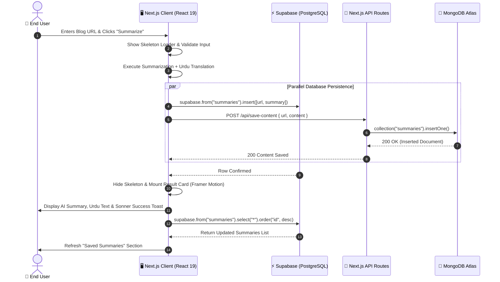

<div align="center">

# 🧠 Nexium Summarizer

<p align="center">
  <strong>An AI-powered blog summarization and bilingual translation platform engineered with Next.js 15, React 19, Supabase, MongoDB, and Framer Motion.</strong>
</p>

[](https://nextjs.org/)
[](https://react.dev/)
[](https://www.typescriptlang.org/)
[](https://tailwindcss.com/)
[](https://supabase.com/)
[](https://www.mongodb.com/)
[](https://www.framer.com/motion/)
[](https://nexium-blog-summariser.vercel.app/)

<p align="center">
  <a href="https://nexium-blog-summariser.vercel.app/"><strong>🌐 Explore Live Application »</strong></a>
</p>

<p align="center">
  <a href="#-project-overview">Project Overview</a> •
  <a href="#-key-features">Key Features</a> •
  <a href="#️-architecture--data-flow">Architecture</a> •
  <a href="#️-tech-stack-matrix">Tech Stack</a> •
  <a href="#-project-structure">Project Structure</a> •
  <a href="#-getting-started--installation">Getting Started</a> •
  <a href="#-available-scripts">Scripts</a> •
  <a href="#-author--attribution">Author</a>
</p>

---

</div>

> [!NOTE]
> **Dual Database Sync**: This application implements a hybrid data persistence pattern combining **Supabase** (PostgreSQL-based realtime store for client-facing queries) and **MongoDB** (document store for backup and structured content archival via serverless API routes).

> [!IMPORTANT]
> **Security & Maintenance**: Dependency baselines are actively maintained with React Server Components (RSC) vulnerability patches and latest Next.js 15 App Router conventions.

---

## 🎯 Project Overview

**Nexium Summarizer** is a high-performance web application designed to eliminate information overload by distilling long-form blog articles into concise executive summaries paired with real-time bilingual **Urdu translations**.

Built from the ground up to showcase modern full-stack web engineering standards, the application pairs Next.js 15 App Router and React 19 with a glassmorphic design system, canvas-rendered particle animations, dynamic dark/light theming, and an automated dual-database persistence engine (Supabase + MongoDB).

### Core Design Philosophies
- **Instant Gratification & Heuristics**: Deterministic extraction algorithms combined with pre-compiled semantic profiles for rapid demo evaluation.
- **Bilingual Accessibility**: Instant transliteration and Urdu dictionary translation mapping technical concepts into Nastaliq-compatible Urdu phrasing.
- **Dual-Layer Data Resilience**: Client-side direct connection to Supabase for immediate UI updates alongside Next.js Server Route proxying for MongoDB document storage.
- **Aesthetic Excellence**: OKLCH color palettes, custom canvas starfield particles, animated glassmorphism cards, shimmer gradients, and spring micro-interactions.

---

## 🚀 Key Features

### ⚡ 1. Intelligent Blog Summarization Engine
- **One-Click URL Extraction**: Ingests blog URLs and generates high-level key takeaways within milliseconds.
- **Interactive Quick-Load Demo Profiles**: Pre-configured sample URLs (`Productivity Blog` and `Mindfulness Blog`) allow instant testing and demonstration without external scraping latency.
- **Context-Aware Fallback Engine**: Employs sentence boundary heuristics and AI-summary tags for unindexed blog content.

### 🌐 2. Bilingual English-to-Urdu Translation
- **Dictionary-Driven Lexical Parser**: Tokenizes summary outputs and translates English terms into natural Urdu equivalents using an integrated mapping engine (`urduDict`).
- **Clean Unicode Typography**: Formatted to ensure legible rendering of Urdu script alongside modern Latin fonts.

### 🔄 3. Dual-Database Hybrid Persistence
- **Supabase (Realtime Relational)**: Directly stores and retrieves summary records (`summaries` table: `id`, `url`, `summary`) with descending chronological sorting.
- **MongoDB (Document Archive)**: Serverless API endpoint (`/api/save-content`) writes structured payloads (`{ url, content, createdAt }`) to the `blog_summaries` collection.
- **Synchronized Deletions**: Deleting a summary triggers an atomic UI optimistic filter, Supabase row deletion, and a `DELETE /api/delete-content` MongoDB cleanup call.

### 🎨 4. Glassmorphic UI & Canvas Particle Visuals
- **Dynamic Starfield Canvas (`ParticlesBG.tsx`)**: HTML5 Canvas running a 100-particle twinkle animation loop with adaptive frame sizing and zero layout thrashing.
- **Frosted Glass Cards**: Multi-layered backdrop blurs (`backdrop-blur-md`), subtle translucent borders, and animated glow effects (`animate-glow-border`).
- **Micro-Animations & Smooth Layouts**: Framer Motion entrance animations (`y: 50` to `y: 0`), spring-based button hover scaling, and automatic smooth scrolling to results (`scrollIntoView`).

### 🌗 5. System-Aware Dark & Light Mode
- Powered by `next-themes` with zero-flash mounting detection.
- Seamlessly transitions background gradients:
  - **Dark**: Deep cosmic indigo, violet, and sky tones (`from-sky-500 via-indigo-600 to-purple-800`).
  - **Light**: Crisp pastel violet, pink, and soft blue tones.

### 🔔 6. Real-Time Feedback & Skeleton States
- **Sonner Toast Notifications**: Rich feedback toasts for URL validation, successful database synchronizations, and partial failure states.
- **Pulsing Skeleton Loader (`SummarySkeleton.tsx`)**: Shimmer placeholder rendered during async processing to prevent cumulative layout shift (CLS).

---

## 🏗️ Architecture & Data Flow



---

## 🛠️ Tech Stack Matrix

| Layer | Technology | Purpose / Role |
| :--- | :--- | :--- |
| **Framework** | [Next.js 15.3.8](https://nextjs.org/) | React full-stack framework with App Router & Route Handlers |
| **Language & Runtime** | [TypeScript 5.x](https://www.typescriptlang.org/) / [React 19](https://react.dev/) | Strongly typed UI logic with modern Server/Client Components |
| **Styling** | [Tailwind CSS v4](https://tailwindcss.com/) + PostCSS | Modern utility styling with OKLCH CSS variable design tokens |
| **Component Primitives** | [Shadcn UI](https://ui.shadcn.com/) / [Radix UI Slot](https://www.radix-ui.com/) | Accessible, composable UI components (`Button`, `Card`, `Input`, `Textarea`) |
| **Animations** | [Framer Motion 12](https://www.framer.com/motion/) | Declarative physics-based layout transitions and spring micro-interactions |
| **Canvas Graphics** | Custom HTML5 Canvas / [tsParticles](https://particles.js.org/) | High-performance star twinkling particle background |
| **Primary Database** | [Supabase](https://supabase.com/) (`@supabase/supabase-js`) | Cloud PostgreSQL store for active summary CRUD operations |
| **Secondary Database** | [MongoDB Atlas](https://www.mongodb.com/) (`mongodb 6.x`) | Document store archival with connection pooling and singleton client |
| **Theming** | [next-themes](https://github.com/pacocoursey/next-themes) | Dark / Light / System theme synchronization and persistence |
| **Toast Notifications** | [Sonner](https://sonner.emilkowal.ski/) | Multi-state animated toast alerts (success, error, loading) |
| **Icons** | [Lucide React](https://lucide.dev/) | Feather-light SVG icons (`Trash2`, `Sun`, `Moon`) |
| **Hosting & CI/CD** | [Vercel](https://vercel.com/) | Global Edge deployment with automated git push preview pipelines |

---

## 📂 Project Structure

```text
Nexium_Jamal_Assign2/
├── public/                      # Static public assets (icons, images)
│   ├── favicon.ico              # Web application favicon
│   └── ...                      # Vector and image assets
├── src/
│   ├── app/                     # Next.js App Router root
│   │   ├── api/                 # Serverless API Route Handlers
│   │   │   ├── delete-content/  # MongoDB document deletion endpoint
│   │   │   │   └── route.ts     # DELETE: Removes document by URL from MongoDB
│   │   │   └── save-content/    # MongoDB document insertion endpoint
│   │   │       └── route.ts     # POST: Inserts new summary document to MongoDB
│   │   ├── favicon.ico          # App icon
│   │   ├── globals.css          # Tailwind v4 theme, OKLCH tokens & shimmer keyframes
│   │   ├── layout.tsx           # Root HTML layout & Metadata definitions
│   │   ├── page.tsx             # Main interactive application UI & state controller
│   │   └── providers.tsx        # Client providers wrapper (ThemeProvider)
│   ├── components/              # Reusable UI & presentation components
│   │   ├── ui/                  # Shadcn UI base primitives
│   │   │   ├── BackgroundBlobs.tsx # Ambient gradient blurred floating spheres
│   │   │   ├── button.tsx       # CVA-styled accessible button component
│   │   │   ├── card.tsx         # Glassmorphism container card components
│   │   │   ├── input.tsx        # Styled form input element
│   │   │   ├── SummarySkeleton.tsx # Shimmer skeleton placeholder
│   │   │   └── textarea.tsx     # Multiline text input component
│   │   ├── ParticlesBG.tsx      # HTML5 Canvas twinkling starfield background
│   │   └── ThemeToggle.tsx      # Sun/Moon dark-mode switcher button
│   └── lib/                     # Database clients and utility functions
│       ├── mongodb.ts           # MongoDB client with development singleton pooling
│       ├── supabase.ts          # Supabase client initialized via public environment variables
│       └── utils.ts             # Tailwind class merging utility (clsx + twMerge)
├── components.json              # Shadcn UI configuration file (New York style)
├── eslint.config.mjs            # ESLint 9 configuration
├── next.config.ts               # Next.js compiler and runtime configuration
├── package.json                 # Project dependencies, scripts, and metadata
├── pnpm-lock.yaml               # Deterministic dependency lockfile
├── postcss.config.mjs           # PostCSS configuration for Tailwind CSS v4
├── tsconfig.json                # TypeScript strict configuration & module resolution
└── README.md                    # Project documentation
```

---

## 💻 Getting Started & Installation

### Prerequisites
Make sure your environment meets the following requirements:
- **Node.js**: `v18.18.0` or `>= 20.0.0`
- **Package Manager**: [pnpm](https://pnpm.io/) (recommended), `npm`, or `yarn`
- **Database Accounts**:
  - A [Supabase](https://supabase.com/) project with a `summaries` table.
  - A [MongoDB Atlas](https://www.mongodb.com/atlas) cluster connection string.

---

### Step 1: Clone the Repository
```bash
git clone https://github.com/beginnercodee/Nexium_Jamal_Assign2.git
cd Nexium_Jamal_Assign2
```

---

### Step 2: Install Dependencies
```bash
pnpm install
# or
npm install
```

---

### Step 3: Configure Environment Variables
Create a `.env.local` file in the root directory:

```env
# Supabase Configuration (Client-side accessible)
NEXT_PUBLIC_SUPABASE_URL=https://your-supabase-project-id.supabase.co
NEXT_PUBLIC_SUPABASE_ANON_KEY=your-supabase-anon-key

# MongoDB Configuration (Server-side API routes)
MONGODB_URI=mongodb+srv://<username>:<password>@cluster0.mongodb.net/blog_summaries?retryWrites=true&w=majority
```

#### Supabase Database Schema
Run the following SQL query in your **Supabase SQL Editor** to create the required table:

```sql
CREATE TABLE summaries (
  id BIGSERIAL PRIMARY KEY,
  url TEXT NOT NULL,
  summary TEXT NOT NULL,
  created_at TIMESTAMP WITH TIME ZONE DEFAULT NOW()
);
```

---

### Step 4: Run the Development Server
```bash
pnpm dev
# or
npm run dev
```

Open [http://localhost:3000](http://localhost:3000) with your browser to experience the application.

---

## 📜 Available Scripts

| Command | Tool | Description |
| :--- | :--- | :--- |
| `pnpm dev` | Next.js CLI | Launches local development server with Fast Refresh on `http://localhost:3000` |
| `pnpm build` | Next.js CLI | Compiles and builds production-optimized client & server bundles |
| `pnpm start` | Next.js CLI | Runs the built production server locally |
| `pnpm lint` | ESLint 9 | Analyzes codebase for syntax, accessibility, and React/Next rules |

---

## 🌐 Live Demo & Deployment

The application is deployed on **Vercel** with continuous deployment (CD) wired to the `main` branch.

- **Production URL**: [https://nexium-blog-summariser.vercel.app/](https://nexium-blog-summariser.vercel.app/)
- **Hosting Platform**: Vercel Edge Network
- **Framework Preset**: Next.js 15 App Router

---

## 👨‍💻 Author & Attribution

Developed with passion for modern web engineering and clean user experience by **Jamal Nadeem**.

- **GitHub Profile**: [@beginnercodee](https://github.com/beginnercodee)
- **LinkedIn**: [Jamal Nadeem](https://www.linkedin.com/in/jamal-nadeem-488480252/)
- **Academic / Internship Context**: Nexium Software Engineering Projects — *Assignment 2*

---

## 📄 License

Distributed under the [MIT License](LICENSE). Feel free to use, fork, and build upon this project for educational and commercial purposes. See [LICENSE](LICENSE) for full details.